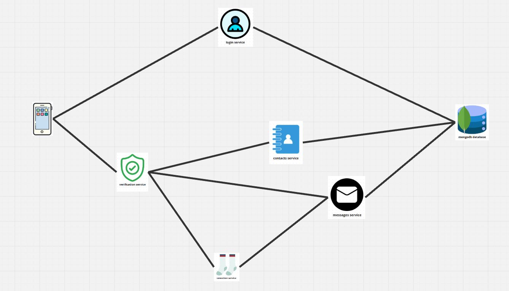

# Live Chat

Welcome to the **Live Chat** repository! This project showcases a chat application backend built using a microservices architecture built with FastAPI.

## Table of Contents

- [Introduction](#introduction)
- [Features](#features)
- [Architecture](#architecture)
- [Services](#services)
- [Technologies](#technologies)

## Introduction

Live chat allows users to send and receive messages in real-time. It is built using a microservices architecture, JWT verification and Websockets. The purpose of the project is to demonstrate my ability to build API's and manage non-relational databases.

## Features

- User authentication and authorization
- Real-time messaging
- Contacts management
- Connection management
- MongoDB for data storage

## Architecture

The application is composed of several microservices, each responsible for a specific functionality. The services communicate with each other using HTTP and WebSockets. Below is an overview of the architecture:

- **Login Service**: Handles user login and token generation.
- **Verification Service**: Manages token verification processes.
- **Contacts Service**: Manages user contacts.
- **Messages Service**: Manages the sending and downloading of messages.
- **Connection Service**: Manages WebSocket communications to enable real time chat conversations.
- **MongoDB Database**: Stores all persistent data for the application.

## Services

### Login Service

- Endpoint: `/login`
- Description: Creates users and provides JWT tokens for session management.

### Verification Service

- Endpoint: `/verify`
- Description: Handles token verification.

### Contacts Service

- Endpoint: `/contacts`
- Description: Manages user contacts.

### Messages Service

- Endpoint: `/messages`
- Description: Manages uploads and download of messages.

### Connection Service

- Endpoint: `/connect`
- Description: Manages WebSocket connections for real-time communication.

## Technologies

- **FastAPI**: Back-end framework for building APIs.
- **MongoDB**: NoSQL database for storing application data.
- **Docker**: Containerization of services.
- **JWT**: JSON Web Tokens for user authentication.
- **WebSockets**: Real-time communication protocol.

